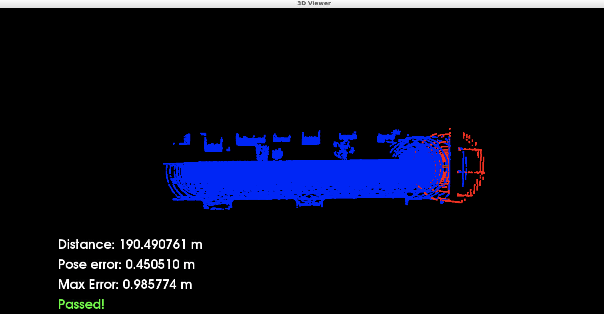
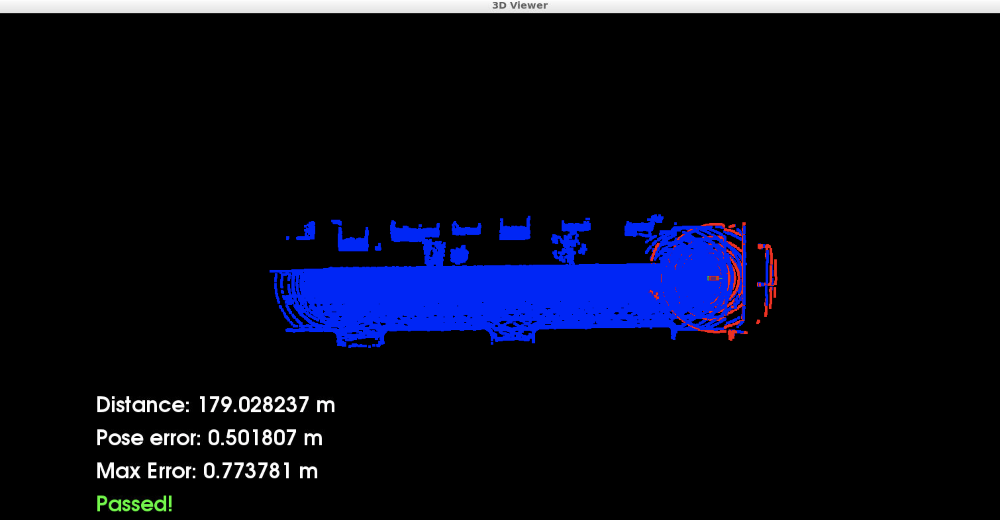

# Scan Matching Localization
The purpose of this project is to implement, use and compare two localisation algorithms (ICP and NDT) in case of a car equipped with a lidar. The target of the application is to keep the max pose error below 1.2m for 170 travelled meters. For testing our algorithms, we use CARLA Simulator to provide lidar scan at regular intervals.

### Installation

This project uses Udacity workspace of the project "Scan Matching Localization" of the Lesson 3 "Localization" of the Self-Driving Car Engineer Nanodegree program.

### Usage

Firstly, to use ScanMatchingLocalisation, Carla simulator needs to be running in the background. To do it, running the following commands:

```
su - student # Ignore Permission Denied, if you see student@ you are good
cd /home/workspace/c3-project
./run_carla.sh
```

Meanwhile, Carla Simulator is running in a dedicated prompt, compile and run ScanMatchingLocalization application using the following commands:

```
cd /home/workspace/c3-project
cmake .
make
./cloud_loc
```

### Results

Using ICP resulted into a 0.95 max pose error:


While using NDT resulted into a 0.77 max pose error:

